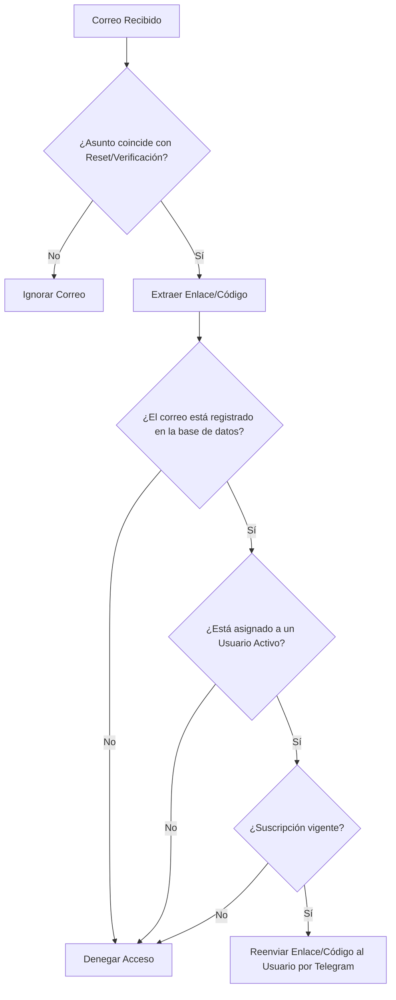

# 🤖 Bot de Códigos para Cuentas de Streaming

¡El gestor y distribuidor definitivo para administradores de cuentas de streaming! Este bot de Telegram permite gestionar el acceso a perfiles/cuentas de streaming (Netflix, Max, Disney+, etc.), realizar un seguimiento estricto de suscripciones de 30 días, y automatizar por completo la entrega de códigos de verificación y restablecimiento de contraseña mediante el monitoreo inteligente de correos electrónicos vía IMAP.

---

## 🌟 Características Principales

*   **👥 Control de Accesos Jerárquico**:
    *   **Owner (Dueño)**: Acceso total, puede registrar administradores (`Admins`) y ver estadísticas globales.
    *   **Admins (Vendedores)**: Registran cuentas de streaming propias y asignan clientes (`Users`) a esas cuentas.
    *   **Users (Clientes)**: Consultan sus cuentas asignadas e historial de códigos directamente desde Telegram.
*   **📧 Monitoreo de Correo Inteligente (IMAP)**:
    *   Lee la bandeja de entrada cada cierto intervalo de tiempo en busca de correos de restablecimiento o verificación.
    *   **Extracción inteligente**: Localiza el enlace o código dentro del cuerpo del mensaje.
    *   **Filtros de Seguridad**: Solo reenvía el código si la cuenta está registrada, asignada y el cliente tiene suscripción vigente.
*   **📅 Control Estricto de Suscripciones (30 días)**:
    *   Cualquier asignación de cuenta se establece exactamente por 30 días.
    *   **Alertas Tempranas**: Envía notificaciones de vencimiento automático 3 días antes de expirar.
    *   **Desactivación en Cascada**: Al expirar el Admin, todos sus clientes asignados pierden acceso inmediatamente de manera segura.
*   **🛡️ DevSecOps & Seguridad por Diseño**:
    *   Validaciones robustas para evitar inyección SQL.
    *   Aislamiento estricto de datos: un Admin no puede ver las cuentas de otro Admin.
    *   Uso estricto de variables de entorno para proteger datos confidenciales.

---

## ⚙️ Arquitectura del Flujo de Trabajo

El siguiente diagrama representa cómo opera el bot cuando entra un correo de verificación:



---

## 📋 Requisitos Previos

Para desplegar este bot, necesitas:
1.  **Python 3.10 o superior** instalado.
2.  Un **Token de Bot de Telegram** (Obtenlo gratis conversando con [@BotFather](https://t.me/botfather)).
3.  Tu **ID de Telegram** para registrarte como el Owner del sistema (Obtenlo con [@userinfobot](https://t.me/userinfobot)).
4.  Una **cuenta de correo** (Gmail, Outlook, etc.) con IMAP habilitado.
    *   *Nota para Gmail*: Debes activar la verificación en dos pasos y generar una **Contraseña de Aplicación** específica para este bot.

---

## 🚀 Instalación y Puesta en Marcha

### 1. Clonar el Proyecto y Preparar Entorno
```bash
git clone https://github.com/KinglotusPe/bot-codigos-streaming.git
cd bot-codigos-streaming
```

### 2. Crear y Activar Entorno Virtual (Recomendado)
En Windows:
```powershell
python -m venv venv
.\venv\Scripts\Activate.ps1
```
En Linux/macOS:
```bash
python3 -m venv venv
source venv/bin/activate
```

### 3. Instalar Dependencias
```bash
pip install -r requirements.txt
```

### 4. Configurar Variables de Entorno
Copia el archivo de plantilla `.env.example` y renómbralo a `.env`:
```bash
cp .env.example .env
```

Abre el archivo `.env` y rellena tus datos privados:
```env
# Token del bot de Telegram
TELEGRAM_BOT_TOKEN=TU_TELEGRAM_BOT_TOKEN

# Tu Telegram ID numérico (serás el dueño/Owner supremo)
OWNER_TELEGRAM_ID=TU_ID_TELEGRAM
OWNER_TELEGRAM_USERNAME=TU_USUARIO_SIN_ARROBA

# Configuración del correo IMAP
EMAIL_CHECK_INTERVAL=60
EMAIL_HOST=imap.gmail.com
EMAIL_PORT=993
EMAIL_USERNAME=tu-correo@gmail.com
EMAIL_PASSWORD=tu_contraseña_de_aplicacion_gmail

# Base de datos (SQLite local rápida)
DATABASE_URL=sqlite:///bot_database.db
```

### 5. Inicializar Base de Datos
Crea las tablas correspondientes en SQLite ejecutando el script inicializador:
```bash
python init_db.py
```
> ⚠️ **Advertencia**: Si en algún momento necesitas borrar todo y empezar de cero, puedes ejecutar `python init_db.py --reset`.

### 6. Iniciar el Bot
```bash
python main.py
```

---

## 📖 Guía Completa de Comandos

El bot cuenta con un menú contextual inteligente que se adapta según el rango del usuario que ejecute `/help`.

### 👑 Comandos Exclusivos del Owner (Dueño)
*   `/addadmin <user_id>`: Registra un nuevo vendedor/admin en la plataforma por 30 días de servicio.
    *   *Ejemplo*: `/addadmin 123456789`
*   `/deladmin <user_id>`: Remueve a un admin y deshabilita inmediatamente a todos los clientes que ese admin haya registrado (limpieza en cascada).
*   `/all_emails`: Genera un reporte detallado con todos los correos e hilos de streaming configurados en el sistema por todos los admins.
*   `/spam <mensaje>`: Envía un boletín o aviso general a todos los usuarios que interactúan con el bot de forma masiva.

### 👤 Comandos de Admins (Vendedores)
*   `/reg <plataforma> <correo>`: Registra una nueva cuenta de streaming bajo tu control.
    *   *Ejemplo*: `/reg netflix mi-cuenta@netflix.com`
*   `/miscorreos`: Muestra el catálogo de cuentas que has registrado junto con su estado de asignación.
*   `/asig <user_id> <plataforma> <correo>`: Asigna un cliente (`user_id`) a una de tus cuentas registradas. Automáticamente le otorga 30 días de suscripción.
    *   *Ejemplo*: `/asig 987654321 netflix mi-cuenta@netflix.com`

### 🍿 Comandos de Usuarios (Clientes)
*   `/list`: Muestra al cliente cuáles son sus cuentas activas asignadas, la plataforma y cuántos días de suscripción le quedan.
*   `/historial`: Muestra un historial con los últimos 10 códigos o enlaces de restablecimiento que ha recibido.

---

## 🛠️ Despliegue en Servidores VPS (Producción)

Para mantener tu bot funcionando las 24 horas del día, los 7 días de la semana, se recomienda alojarlo en un servidor Linux VPS.

### Despliegue usando `systemd` (Recomendado para Debian/Ubuntu)
1. Crea un archivo de servicio del sistema:
   ```bash
   sudo nano /etc/systemd/system/bot-streaming.service
   ```
2. Pega el siguiente contenido (Asegúrate de cambiar las rutas por las de tu servidor):
   ```ini
   [Unit]
   Description=Bot de Códigos para Streaming
   After=network.target

   [Service]
   Type=simple
   User=root
   WorkingDirectory=/root/bot-codigos-streaming
   ExecStart=/root/bot-codigos-streaming/venv/bin/python main.py
   Restart=always
   RestartSec=5

   [Install]
   WantedBy=multi-user.target
   ```
3. Guarda el archivo y ejecuta los siguientes comandos para iniciar y habilitar el auto-arranque:
   ```bash
   sudo systemctl daemon-reload
   sudo systemctl enable bot-streaming.service
   sudo systemctl start bot-streaming.service
   ```
4. Para monitorear el log en tiempo real:
   ```bash
   sudo journalctl -u bot-streaming.service -f
   ```

---

## ❓ Preguntas Frecuentes & Solución de Problemas

**P: ¿Por qué el bot da error al conectar con el correo?**
*R:* Verifica que el IMAP esté habilitado en la configuración de tu correo de destino. Si usas Gmail, asegúrate de estar utilizando una **Contraseña de Aplicación de 16 dígitos** en `.env`, no la clave ordinaria con la que inicias sesión en el navegador.

**P: ¿Qué pasa si expira un Admin en el sistema?**
*R:* El bot cuenta con un Scheduler diario. Si el acceso del Admin vence, su estado cambia a `Inactive` y de forma automática e inmediata, todos los usuarios clientes vinculados a ese Admin quedan desactivados.

**P: ¿Dónde se guardan los datos del bot?**
*R:* Se guardan en una base de datos local SQLite (`bot_database.db`). Este archivo se genera automáticamente al ejecutar `python init_db.py`. **Recuerda respaldar este archivo de vez en cuando**.

---

## 📄 Licencia

Este proyecto está bajo la Licencia **MIT**. Eres libre de usarlo, modificarlo y distribuirlo comercialmente siempre y cuando mantengas los créditos originales. 

---

*¡Desarrollado de manera limpia, segura y eficiente! Creado para ser ligero y de altísimo rendimiento.*
